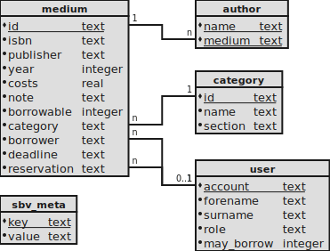

# SchillerLib

The Schiller library software:
A small, simple, and intuitive library program for school libraries.

## Rework

This project is currently in a highly unstable stage due to a fundamental rework!

### Frontend

- [x] Multi Language Support
- [ ] Server Requests -> Error Modal
- [ ] Borrowed Page
- [ ] Infos Page
- [x] Borrow/Reserve/Extend Modal
- [x] Books/User List with Search and Adding Button -> Set Up a Grid and Generalize
- [x] Page Views including editing, deleting,...

### Backend

- [x] Static assets
- [x] TLS
- [x] About, Statistics, ...
- [x] Books
- [x] Users
- [x] Categories
- [x] Lending, Reserving, Overdues
- [x] Updating User Roles
- [x] Fetching Book Data
- [x] E-Mails
- [x] OAuth & Logins

### Download

The latest builds can be downloaded from the [releases page](https://github.com/wrenger/schiller-lib/releases/latest).


## Usage

The webserver uses [Rust](https://www.rust-lang.org/learn/get-started), which has to be installed first.

Using cargo, the project can be built and executed:

```sh
# generate TLS certificates with OpenSSL
./test/data/cert/gen.sh
# prepare the auth.json with client_id, client_secret, auth_url, token_url, user_url
# start the webserver on port 5000
cargo run -- 127.0.0.1:5000 -d lib.db --cert test/data/cert/cert.pem --key test/data/cert/key.pem --user-file users.txt --auth auth.json
```

> A new database is created if the provided path to the database is non-existent.

## Architecture

This application follows the 3-tier principle.

- **UI Layer:** This is implemented in svelte and TypeScript.
- **Application Layer:** This is implemented in Rust using the [axum](https://github.com/tokio-rs/axum) webserver.
It contains the business logic; most of the computation is done in this layer.
- **Database Layer:** The SQLite database that stores the persistent data specific to a project.

### UI Layer

> **TODO:** Update description

The [UI](ui) is developed in Godot with GDScript for interactions and
interfacing with the GDNative application layer.

This layer is also responsible for internationalization
([translations.csv](translations/translations.csv)).
Currently, there are only two languages supported (English and German).
Contributions for new languages or improved translations are very welcome.

### Application Layer

This layer is implemented in Rust ([src](src)) and exposes a REST API ([src/server](src/server/mod.rs)) that is used by the UI.

It is responsible for consistency checks and business logic.
This layer also manages the user logins and database connections, fetches data from external sources, and sends E-Mail notifications.

### Database Layer

The [SQLite](https://sqlite.org/index.html) database has the following schema:



It contains any project-specific data and settings and can be distributed as such.

## Package & Distribute

After building the GDNative library, the project can be exported within the Godot editor.

> See https://docs.godotengine.org/en/stable/getting_started/workflow/export/index.html

Alternatively, this can be done from the command line:
```bash
# linux
mkdir export/x11
path/to/godot --export x11 export/x11/schiller-lib.x86_64
# windows
mkdir export/win
path/to/godot --export win export/win/schiller-lib.exe
```
